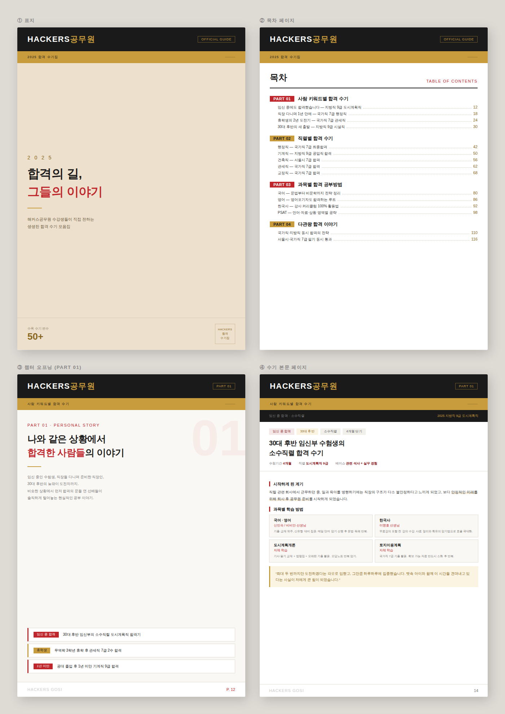

# TM (Transfer Memory) — 공무원 합격수기집 제작 프로젝트

> **"당신과 닮은 합격자의 기록이 여기 있습니다. 이제 당신의 차례입니다."**

본 프로젝트는 공무원 시험 합격수기 2,114개를 정밀 분석하여, 단순한 수기 나열이 아닌 **나와 가장 닮은 합격 사례**를 즉각적으로 찾아볼 수 있는 **데이터 기반 합격 수기집** 제작을 목표로 합니다.

## 1. 배경 (Background)

공무원 시험 준비생들이 겪는 가장 큰 고통은 '**고립감**'과 '**불안**'입니다. 
- "직장을 다니면서 합격할 수 있을까?"
- "노베이스인 내가 시작해도 될까?"
- "아이를 키우며 공부하는 사람이 또 있을까?"

수많은 합격수기가 인터넷에 존재하지만, 자신과 비슷한 환경의 사례를 찾기 위해서는 수많은 글을 직접 읽어봐야 하는 번거로움이 있습니다. 본 프로젝트는 이러한 탐색 비용을 줄이고, 수험생들에게 실질적인 용기를 주기 위해 시작되었습니다.

## 2. 목적 (Purpose)

본 프로젝트의 최종 목표는 수험생이 책장을 넘기다 **"이건 내 이야기잖아?"**라고 느낄 수 있는 맞춤형 합격 수기집을 만드는 것입니다.
- **용기 부여**: 자신과 유사한 환경(페르소나)에서 합격한 사례를 통해 "나도 할 수 있다"는 확신을 제공합니다.
- **데이터 기반 신뢰**: 해커스 공무원 합격수기 2,114건의 데이터를 전수 조사하여 객관적이고 신뢰할 수 있는 정보를 제공합니다.
- **효율적 정보 전달**: 각 수기에 풍부한 **메타데이터(태그)**를 부여하여, 독자가 자신에게 필요한 정보를 즉시 필터링하여 읽을 수 있도록 구성합니다.

## 📖 수기집 시안 (Design Draft)

본 프로젝트가 지향하는 수기집의 레이아웃과 구성은 아래 시안을 바탕으로 제작되고 있습니다.



- **핵심 구성**: 합격자 페르소나, 준비 기간, 베이스(노베이스/수능 등), 학습 시간, 과목별 강사 및 교재 메타데이터가 시각적으로 배치됩니다.

## 🛠 데이터 및 기술적 접근 (Technical Approach)

종이책 제작을 위한 고도화된 데이터 정제 작업을 진행하고 있습니다.

- **AI 기반 메타데이터 추출**: Claude 3.5 Sonnet을 활용하여 2,000건 이상의 수기 본문에서 핵심 태그(상황, 베이스, 공부법), 강사명, 교재명을 정밀 추출합니다.
- **전수 크롤링 및 DB화**: 2,114개의 합격수기를 수집하여 SQLite DB로 구조화함으로써, 수기집 편집 시 다양한 조건별(직렬별, 기간별, 상황별) 사례 추출이 가능하도록 설계했습니다.
- **페르소나 분류**: 수험생의 전형적인 특징을 데이터로 군집화하여 수기집의 각 챕터를 구성합니다.

## 📂 프로젝트 구조 (Project Structure)

```text
.
├── plan&design/            # 수기집 기획서 및 [수기집_시안.png]
├── crawler/                # 합격수기 원천 데이터 수집 엔진
├── extract_tags.py         # AI 기반 메타데이터(태그/강사/교재) 추출기
├── build_db.py             # 분석된 데이터를 통합 관리하는 SQLite DB 구축
├── reviews.db              # 2,114개 수기의 정제된 데이터베이스
├── all_reviews.json        # 수집된 원본 수기 데이터
└── README.md               # 프로젝트 안내서
```

## 📊 현재 진행 상황 (Status)

| 항목 | 진행도 | 상태 |
| :--- | :--- | :--- |
| **수기 원천 데이터 수집** | 2,114 / 2,114 | ✅ 완료 |
| **수기집 기획 및 시안 제작** | - | ✅ 완료 |
| **few_shot prompting(30개 데이터)** | - | ✅ 완료 |
| **AI를 활용한 메타데이터 추출** | - | ✅ 완료  |
| **AI를 통해 추출한 메타데이터 검증** | 김태연 직접 | ✅ 완료 |
| **챕터별 수기 분리** | AI로 1차, 김태연 2차(추리는 작업) | 진행중 |
| **수기집 원고 편집 및 자동화** | - | ⬜ 예정 |

---
*이 책은 모든 수험생이 자신만의 합격 경로를 찾고, 망설임 없이 도전할 수 있도록 돕는 가장 든든한 가이드가 될 것입니다.*
